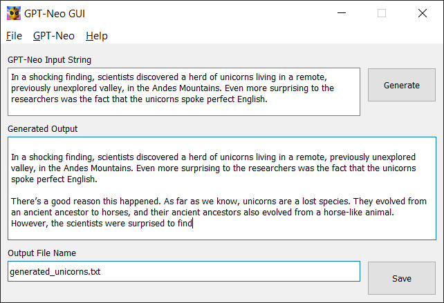
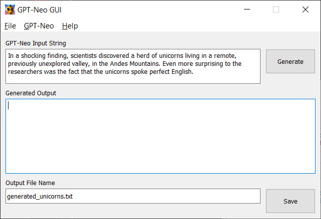
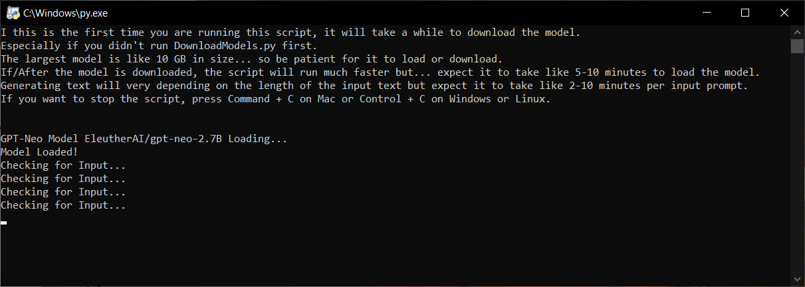
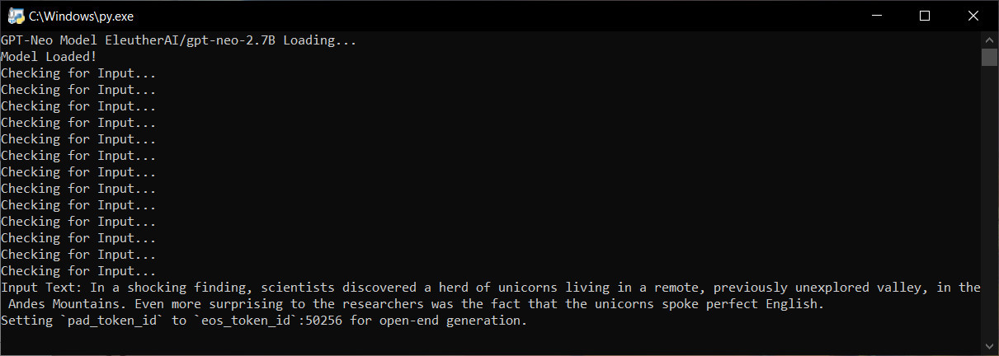
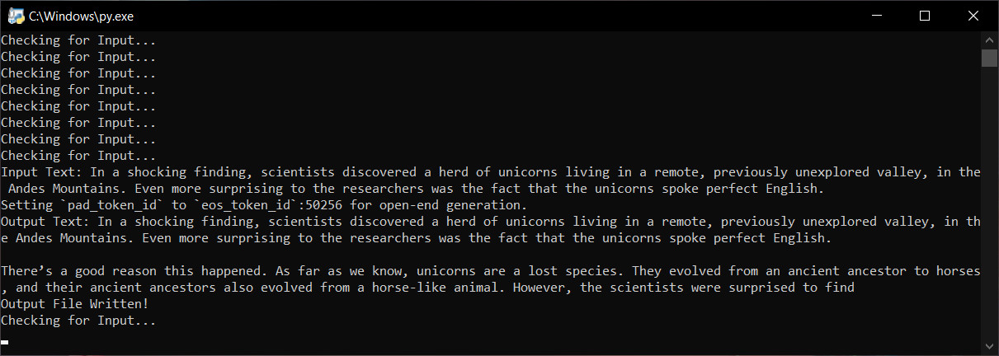
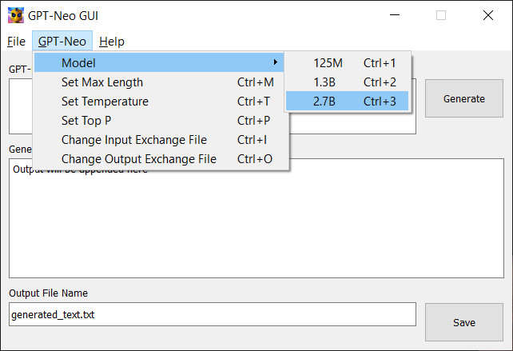

# GPT-NEO GUI


GPT-NEO GUI is a point and click interface for [GPT-NEO](https://github.com/EleutherAI/gpt-neo) that lets you run it locally on your computer and generate text without having to use the command line. It also lets you save the generated text to a file. 



It is written in Python and uses QtPy5 for the GUI.

This program has not been reviewed or endorced by EleutherAI or any of the authors of GPT-NEO. It is just a simple crossplatform GUI for GPT-NEO that I made for fun.

I hope you enjoy it and find it useful! :-)


# Installation

First, install Python from [https://www.python.org/downloads/](https://www.python.org/downloads/)

**NOTE:** GPT-NEO GUI is tested to work with 3.7.9 [https://www.python.org/downloads/release/python-379/](https://www.python.org/downloads/release/python-379/), and I am unsure if it will work with earlier or later versions.


Next, install Git from [https://git-scm.com/downloads](https://git-scm.com/downloads).

Next, open a command line/terminal, make a folder where you want the GPT-NEO GUI, navigate to that folder, and run the following command:

```
git clone https://github.com/geekgirljoy/GPT-Neo-GUI.git
```

Then, install the python environment requirements & dependencies (this may take a while to complete):

```
pip install -r requirements.txt
```

Next you install the GPT-NEO model by running the [DownloadModels.py](DownloadModels.py) script (this WILL take a while to complete):

```
py DownloadModels.py
```


# Running the GPT-NEO Agent

GPT-NEO is run in its own terminal window, this keeps the model running and waiting for input from the GUI.

The GPT-NEO agent can be run by opening a terminal and running the following command:

```
py GPTNEO.py
```

Or by double clicking the [GPTNEO.py](GPTNEO.py) file in the folder.

**NOTE: YOU HAVE TO RUN GPTNEO.py OR YOU WILL NOT GENERATE ANY OUTPUT.**


# Running the GPT-NEO GUI

The GPT-NEO GUI can be run by opening a terminal and running the following command:

```
py GPTNEOGUI.py
```

Or by double clicking the [GPTNEOGUI.py](GPTNEOGUI.py) file in the folder.

Additionally, the the GPT-NEO GUI can be run without its own terminal window by running the following command:

```
py GPTNEOGUI.pyw
```
Or by double clicking the [GPTNEOGUI.pyw](GPTNEOGUI.pyw) file in the folder.

You only need to run GPTNEOGUI.py or GPTNEOGUI.pyw, the .pyw just trys to spawn the program without a visable terminal.


# Using GPT-NEO GUI

It's pretty straightforward, just type in the text box and press generate and wait (depending on the model you choose and the length of the input and the tangent that GPT-NEO go on... this can take a bit, usually takes me between 2-10 minutes to generate a few hundred words with the largest 2.7B model) for the GPT-NEO agent to generate the text. 



Once the text is generated, it will appear in the text box below. 


You can edit the text if you want and press the save button to save the generated text (and any edits) to a file and if the file already exists, it will append the text to the end of the file.

Below the output text is a field where you can enter a file name to save the generated text to. If you leave this blank, it will save the text to a file named "generated_text.txt".


# Troubleshooting

### If you press generate and never get any output.

Make sure the GPT-NEO agent is running. It should be in it's own terminal window and should say "Checking for Input...". 



If it is not running, make sure you ran [GPTNEO.py](GPTNEO.py) in addition to [GPTNEOGUI.py](GPTNEOGUI.py) or [GPTNEOGUI.pyw](GPTNEOGUI.pyw).

Once the GPT-NEO detects the input, it will say "Input Text: " followed by the input text and will begin generating the output.



Once the output is generated, it will say "Output Text: " followed by the output text.




### If you press generate and never get any output other than your input.

Your input prompt is probably too long, try shortening it OR increase the Max Length in the GPT-NEO GUI settings.




# Credits

### GPT-NEO GUI

Created by: [GeekGirlJoy](https://github.com/geekgirljoy)

### GPT-NEO

Created by [EleutherAI](https://github.com/EleutherAI/gpt-neo)

Authors: Black, Sid and Gao, Leo and Wang, Phil and Leahy, Connor and Biderman, Stella
